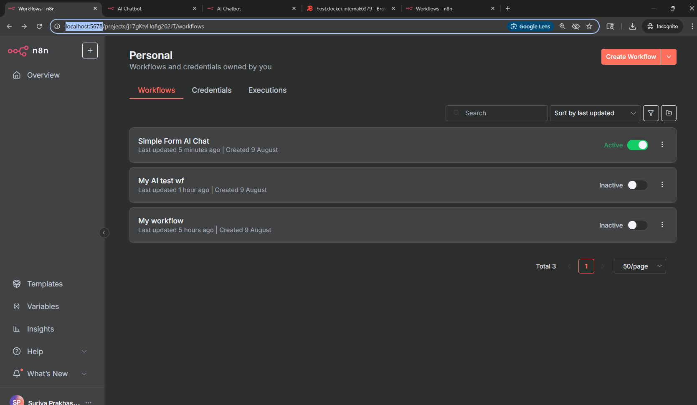
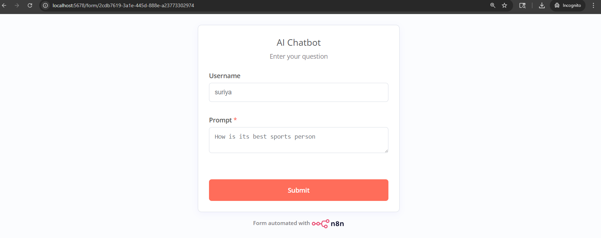

# n8n with PostgreSQL

Starts n8n with PostgreSQL as database. Referenced from [n8n-docker](https://github.com/n8n-io/n8n-docker).



## Start

Run n8n and postgres,
```
docker compose up
```

Navigate to [redis](../redis) and also run redis and redis insight

- Login to n8n at http://localhost:5678/
- If you are seeing a blank screen, try importing [Simple Form AI Chat](Simple%20Form%20AI%20Chat.json)

## Simple AI chat example

- This uses **username** and **prompt** as input.
- **username** is for the Key for the redis memory to remember the conversation.
- **prompt** is the message to be sent to the bot.